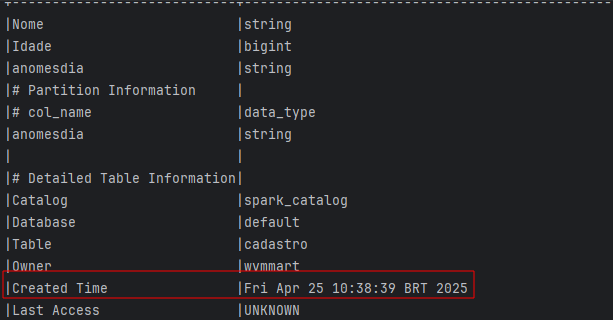

**O modelo irá demonstrar como a execução das funções ```saveas()``` e o ```insertinto()```,**
**são funções utilizadas para a criação de tabelas no metastore do Spark.**

---

> Função SAVEAS()
- Usar o modo overwrite garante que a tabela existente seja excluída e recriada com os novos dados.

Ao executar o arquivo saveas_teste.py, irá criar o metastore que armazenará a tabela.


**Execute o arquivo verifica_integridade.py, para analisar a data e horário de criação da tabela.**
- **Data criação da tabela atual**

- 

**Ao executar novamente o arquivo saveas_teste.py, irá dropar e recriar a tabela com os dados do dataset, alterando o horário de criação.**




---

> **Função INSERTINTO()**

A função ```insertinto()``` depende que a tabela já esteja criada, a função realiza somente o insert, será aproveitada a mesma tabela que o a função ```saveastable()``` criou.

A função ```insertinto()``` mesmo escolhendo o modo **overwrite** ou **append**, não irá recriar a tabela.

**Ao executar novamente o arquivo insertinto_teste.py, irá atualizar somente os registros da tabela, Mantendo o horário de criação da tabela.**

